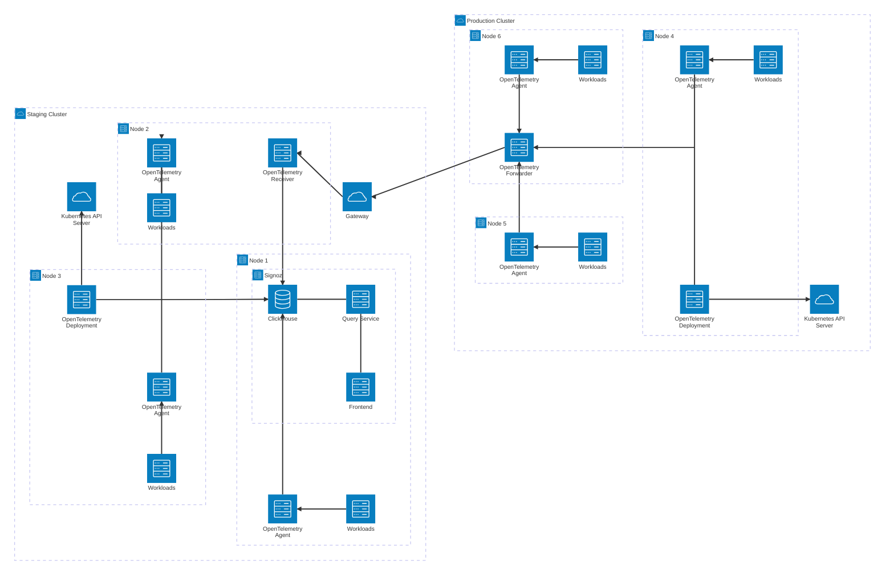

# Setting up Observability for Kubernetes

## Our requirements

- Uses OTel
- Simple to set up and maintain
- Relatively cheap
- High enough adoption that community support exists
- Secure

## Architecture

