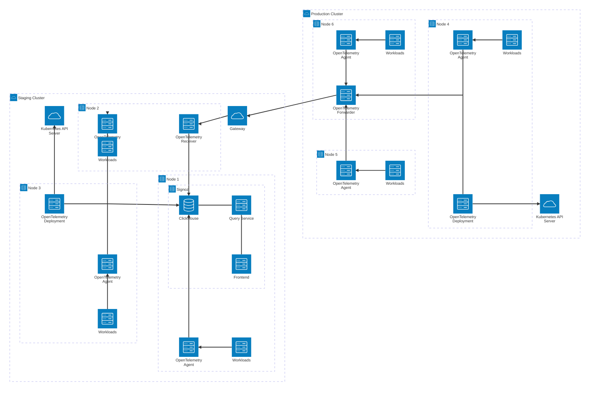

# Setting up Observability for Kubernetes

Kubernetes is a great way to host containerized applications across multiple
nodes (VMs). However, the distributed nature of these workloads can make them
hard to monitor and debug. That's where an observability stack comes in. It
provides a way of describing application performance and internal state across
distributed architectures using three "pillars": metrics, logs, and traces.

{/* truncate */}

## OpenTelemetry

OpenTelemetry (OTel) is an open standard for logs, metrics, and traces. It
defines a standard format to export these signals, a set of attributes that they
should use, and provides language SDKs for most popular languages. An important
feature compared to other stacks and standards is that it uses the same
attributes (as appropriate) for all three signals. This makes it easy to
correlate between them when debugging an application. Across the industry, it is
being widely adopted. Existing stacks have added support and new stacks ship
with native support out of the box.

## Notable Observability Stacks

### LGTM

The LGTM stack consists of Loki, Grafana, Tempo, and Mimir. It, and its
variations swapping out one or more components, is probably the most
industry-standard open source observability stack. Loki handles the logs,
Grafana the visualization, Tempo the traces, and Mimir the metrics. It is
supported by Grafana Labs, and offers enterprise support contracts. Common
substitutions include Jaeger for traces and Prometheus for metrics.

### ELK

The ELK stack consists of Elasticsearch, Logstash and Kibana. It has been around
for a while, but it primarily focuses on logging. Elasticsearch acts as the
database, indexing, storing, and querying the logs. Logstash is the data
processing pipeline that transforms the various log sources and formats into a
standard set of attributes. Finally, Kibana provides the frontend and
visualization for the logs. ELK is still a useful, industry-standard stack for
logs, but lacks the additional features of a full OTel stack, so users need to
deploy separate services (e.g., Prometheus and Jaeger) if they want to also
collect metrics and traces.

### Signoz

Signoz is an all-in-one observability stack. It stores logs, metrics, and traces
in a ClickHouse database, and offers visualization capabilities on top of it.

### OpenObserve

OpenObserve is another all-in-one observability stack. It uses a single
rust-based binary to manage all of the observability pillars, storing them
either in a local SQLite database or in Postgres.

### Datadog

Datadog is a proprietary, enterprise-level observability platform. It provides
an agent that you install into your cluster which then exports your
observability data to their cloud. It has very easy setup, and you can pay for
extra support. However, this premium support and their hosting comes with a
higher price tag. The price scales per node, user, and feature.

### New Relic

New Relic is similar to Datadog, but with more of a focus on Application
Performance Monitoring than infrastructure monitoring. Its pricing is
additionally billed per user seat and ingestion volume, rather than also by
host. This means that for complex setups it can be cheaper.

## Our Implementation

### Requirements

JMA Consulting is a very small company, which doesn't specialize in Kubernetes.
As such, we had a set of requirements which was slightly different than many
other companies setting up observability. Our requirements were:

- **Industry Standard**. We wanted to be using a widely adopted piece of
  software so that if issues arose, we could get community support.
- **Simple to set up and maintain**. We only have a small number of engineers,
  so we can't afford to have someone spend a significant amount of time
  maintaining an observability stack
- **Relatively cheap**. As a small company, JMA Consulting only has so much
  budget that it can throw at observability, so ideally we can avoid high costs.
- **Secure**. Our observability stack contains internal information about our
  infrastructure, so we do not want it to be compromised.

### Decision: Signoz

For our requirements, we decided that Signoz was the right choice for us.
Datadog and New Relic were too expensive. An LGTM or ELK stack introduced too
much operational overhead. And OpenObserve was too untested, lacking the size of
community that the other solutions offered. We found that Signoz gave us a good
middle ground: lower up-front costs because we self-hosted, and less operational
overhead since it can be deployed from a single helm chart. It is worth noting
that we determined it would cost less overall than an enterprise solution
because we don't expect to need to significantly scale its deployment, which
might not be the case in other small companies, for example, at a startup.

### Architecture

We deployed Signoz on our staging cluster, since we decided to only run two
clusters (we felt we didn't have sizeable enough workloads to justify a third
cluster for observability/tooling). We then deployed the OTel collector as an
agent and deployment in both the production and staging clusters. The agent
(DaemonSet) collects the logs and host metrics from each Node, while the
deployment collects metrics and events from the Kubernetes API Server.

We then needed to get the observability data from the production cluster to the
staging cluster. This requires authentication and authorization so that
malicious actors can't overwhelm our observability stack. We opted for HTTP
basic auth, since it is simple to set up for a small number of users. We
encrypted traffic with TLS terminated at the Gateway level in the staging
cluster. We deployed an additional OTel collector in each cluster: one in the
production cluster to aggregate the data and forward it, and one in the staging
cluster to receive it and export it to Signoz. You can see a diagram of it
below:

## Conclusion

In this article I shared how we set up observability for our Kubernetes
clusters, our considerations when choosing a stack, and our final architecture.
What would you do differently for your own observability setup?
