# Setting up Observability for Kubernetes

## Background

While I was working at JMA Consulting, we wanted to implement an observability system for their Kubernetes infrastructure.

## Implementation

